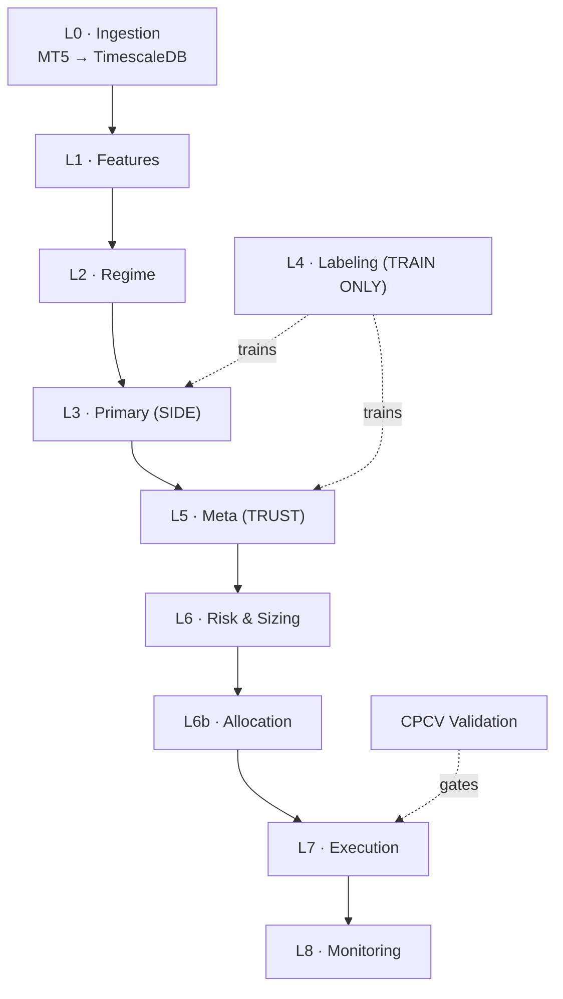

# Aura-X — ML-Driven Adaptive Trading System

> EURUSD · GBPUSD · **H4** · MT5 execution
> Python · FastAPI · TimescaleDB · LightGBM / CatBoost / CNN · MQL5

Aura-X is a **layered, defensive** ML trading system built on the meta-labeling
philosophy: *don't just predict direction — predict whether to act, and size by
volatility and confidence, not conviction.* A direction model is a noisy idea
generator; a second model decides whether each idea is worth risking capital on;
volatility decides how much; a regime layer decides which behavior is even
appropriate right now.

See [`docs/architecture.md`](docs/architecture.md) for the full design rationale.

---

## The 8-Layer Pipeline

| Layer | Module | Role | Status |
|------:|--------|------|--------|
| **L0** | [`aurax.l0_data`](src/aurax/l0_data) | MT5 → TimescaleDB ingestion (OHLCV H4/D1/M15 + tick/spread) | ✅ implemented |
| **L1** | [`aurax.l1_features`](src/aurax/l1_features) | ATR · Yang-Zhang · Hurst · KER · cross-pair · session features | ✅ implemented |
| **L2** | [`aurax.l2_regime`](src/aurax/l2_regime) | Gaussian HMM + Hurst/KER gate + shock stand-down (trend / range / shock) | ✅ implemented |
| **L3** | [`aurax.l3_primary`](src/aurax/l3_primary) | Primary SIDE model — GBM/logistic + deep (CNN/PatchTST/SSM) ensemble, regime-conditional, high recall | ✅ implemented |
| **L4** | [`aurax.l4_labeling`](src/aurax/l4_labeling) | Triple-Barrier (ATR-scaled) + sample-uniqueness weights + trend-scanning | ✅ implemented |
| **L5** | [`aurax.l5_meta`](src/aurax/l5_meta) | Meta-label TRUST model — calibrated (isotonic/Platt) meta-learner on OOF predictions, P(correct) gate at τ | ✅ implemented |
| **L6** | [`aurax.l6_risk`](src/aurax/l6_risk) | `RiskManager`: ATR sizing × confidence × **covariance** correlation cap + circuit breaker | ✅ implemented |
| **L6b** | [`aurax.l6_risk.allocation`](src/aurax/l6_risk) | `DirichletAllocator`: Dirichlet-policy **PPO** allocator over the instrument simplex, cost/risk-penalized reward (optional — matters once the universe grows past two instruments) | ✅ implemented |
| **L7** | [`aurax.l7_execution`](src/aurax/l7_execution) | Guarded orders (spread/news/slippage), idempotent IDs, retry, ATR stops · Paper/MT5 brokers | ✅ implemented |
| **L8** | [`aurax.l8_monitoring`](src/aurax/l8_monitoring) | `Monitor`: fill/breach/regime/decay alerts · rolling Sharpe + calibration-drift → retrain · dashboard | ✅ implemented |
| — | [`aurax.validation`](src/aurax/validation) | **CPCV** (purge+embargo) · purged-KFold OOF · walk-forward · holdout · cost-adjusted baselines · deflated Sharpe · **Go/No-Go** | ✅ implemented |

**All 8 layers (L0–L8) + the validation gate are implemented** (working code +
tests), and **Roadmap v1 (core edge), v2 (architecture matching) and v3
(allocation) are all done.** v2 added deep CNN/PatchTST/SSM ensemble members +
automated decay→retrain→gate→promote (in [`aurax.lifecycle`](src/aurax/lifecycle));
v3 promoted **L6b** from a stub to a real Dirichlet-policy PPO allocator. v3's
other half — expanding the instrument universe beyond EURUSD/GBPUSD (e.g.
USDJPY, XAUUSD) — is a deliberate, separate decision (new broker specs, MT5
symbol mapping, cross-pair feature wiring) and is **not** done here; L6b
itself is written for any N ≥ 2 instruments and is ready for it.
`✅ implemented` = working code + tests.



### Training vs. inference paths (kept strictly separate)

- **Training:** `L0 → L1 → L4 (labels+weights) → L2/L3 (fit primary) → L5 (fit meta on out-of-fold preds) → CPCV`
- **Inference:** `L0 → L1 → L2 → L3 → L5 → L6 → L6b → L7 → L8`

Triple-Barrier and CPCV exist **only** in training. ATR sizing, meta-gating and
execution guards run live. The meta-model is trained on the primary model's
**out-of-fold** predictions — never in-sample.

---

## Repository layout

```
Aura-x/
├── config/              # YAML config: instruments, features, labeling, defaults
├── docs/                # architecture.md (source of truth)
├── sql/                 # TimescaleDB migrations (hypertables, continuous aggregates)
├── src/aurax/
│   ├── config.py        # pydantic-settings loader (env + YAML)
│   ├── enums.py         # Side, Regime, Timeframe, Session, BarrierTouch
│   ├── types.py         # shared dataclasses (Bar, FeatureVector, Label, ...)
│   ├── db/              # SQLAlchemy engine + repositories
│   ├── l0_data/         # ✅ MT5 client, ingestion, TimescaleDB storage
│   ├── l1_features/     # ✅ volatility / trend-memory / cross-pair / session
│   ├── l2_regime/       # ✅ Gaussian HMM + Hurst/KER gate + shock stand-down
│   ├── l3_primary/      # ✅ SIDE ensemble — GBM/logistic + deep CNN/PatchTST/SSM (v2)
│   ├── l4_labeling/     # ✅ triple-barrier, uniqueness, trend-scanning
│   ├── l5_meta/         # ✅ calibrated TRUST meta-model (OOF), P(correct) gate
│   ├── l6_risk/         # ✅ RiskManager + L6b DirichletAllocator (PPO, v3)
│   ├── l7_execution/    # ✅ guarded orders, idempotent IDs, retry, Paper/MT5 brokers
│   ├── l8_monitoring/   # ✅ alerts, decay detection, dashboard (Monitor)
│   ├── lifecycle/       # ✅ training pipeline + decay-triggered retrain→gate→promote (v2)
│   ├── validation/      # ✅ CPCV, walk-forward, holdout, baselines, deflated Sharpe
│   └── api/             # FastAPI app (health · data · features · labels · monitor)
├── mql5/                # MT5 Expert Advisor + includes (execution side)
├── scripts/             # ingest / build_features / make_labels / validate entry points
└── tests/               # pytest suite (107 tests across L0–L8 + validation + lifecycle)
```

---

## Quickstart

```bash
# 1. Install the data/feature/labeling stack (no broker or DB needed)
python -m venv .venv && source .venv/bin/activate
pip install -e ".[dev]"

# 2. Run the full test suite (all 8 layers + the validation gate)
pytest                      # L0–L8 + CPCV/walk-forward/holdout

# 2b. Run the validation gate end-to-end on synthetic data (no DB/MT5 needed)
#     Uses the real L3 ensemble — logistic member by default; add the GBM backbone
#     with `pip install -e ".[models]"` (LightGBM/CatBoost).
python -m scripts.validate --demo     # expect NO-GO — the gate rejecting noise

# 3. Spin up TimescaleDB and apply migrations
docker compose up -d db     # migrations in ./sql auto-run on first boot

# 4. (on a Windows MT5 host) pull data, then build features + labels
pip install -e ".[db,mt5]"
python -m scripts.ingest --pairs EURUSD GBPUSD --timeframe H4
python -m scripts.build_features
python -m scripts.make_labels
```

> **MetaTrader5** is a Windows-only package and is an *optional* dependency.
> The L0 client degrades gracefully on other platforms so features and labels
> can be developed and tested anywhere; only live ingestion/execution needs MT5.

---

## Validation gate (the gatekeeper)

Nothing reaches Layer 7 without clearing [`aurax.validation`](src/aurax/validation).
The harness implements the §5 protocol end-to-end:

- **CPCV** with purge + embargo, and **purged k-fold** for out-of-fold predictions
  (the exact input the L5 meta-model must train on — `oof_predict`).
- **Walk-forward** (anchored/rolling) + a final **never-touched holdout**.
- **Cost-adjusted** event backtest (spread + slippage + commission) reported
  **against three baselines** — majority-class, Buy-and-Hold, random-entry.
- **Deflated Sharpe** discounting for the number of configurations tried.
- A single **Go/No-Go** `ValidationReport` with explicit reasons.

```python
from aurax.validation import run_validation, ValidationConfig
report = run_validation(MakeModel, X, y, t1=t1, ret=ret, labels=labels, close=close)
print(report.summary())     # ✅ GO / ⛔ NO-GO + CPCV/WF/holdout/baselines/DSR
```

> **Build the validation harness before risking capital** — it is built first
> here on purpose. On random-walk data the gate correctly returns **NO-GO**: a
> seductive CPCV Sharpe collapses under walk-forward, holdout and deflation.

## Honesty note

This is a sound, defensible **design** — not a guarantee of profit. The
researched results it draws from were marginal and unverified (PPO Sharpe 0.73
vs. Buy-and-Hold 0.66 at *identical* drawdown). Whether this system has a real
edge is a question only the Layer-8 / validation harness can answer. **Build the
validation harness before risking capital** — it will save you from your own
backtests.
